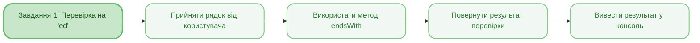
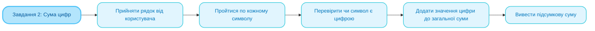
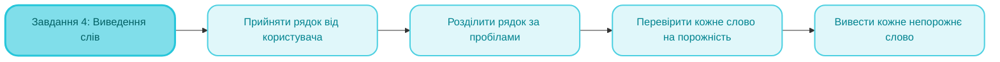
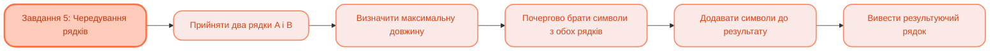

<sup>📒 Readme ver 1.0 07.10.2025 16:20<sup/>

<picture>
  <source media="(prefers-color-scheme: dark)" src="https://github.com/user-attachments/assets/3099ab98-c824-471a-ae04-1c04cef81c26" />
  <source media="(prefers-color-scheme: light)" src="https://github.com/user-attachments/assets/0aecfea6-0be1-4282-a753-f3324645d5af">
  
</picture>

# `Лабораторна робота` `№1` `Основи роботи з рядками та методами.`

[](https://docs.google.com/document/d/19unIe4WaBjPMkZOxbllCGPG0m37LRf8r/edit?usp=drive_link&ouid=110536394177911584125&rtpof=true&sd=true)
[](https://github.com/Soluvent)


[](https://github.com/Soluvent/StringMethods-First/edit/main/README.md)

## `📝 Завдання `
### 1. Перевірка закінчення рядка на «ed»
  - [x] Реалізувати метод, який приймає на вхід рядок
  - [x] Повертає true, якщо рядок закінчується на «ed»
  - [x] Повертає false у противному випадку

### 2. Сума цифр у рядку
  - [x] Реалізувати метод, який приймає на вхід рядок
  - [x] Знаходить всі цифри у рядку
  - [x] Повертає їх суму (якщо цифр немає – повертається 0)

### 3. Довжина найдовшого блоку символів
  - [x] Реалізувати метод, який приймає на вхід рядок
  - [x] Знаходить найдовший «блок» однакових символів, що йдуть поспіль
  - [x] Повертає довжину цього блоку
  - [x] Обробляє порожні рядки

### 4. Виведення слів з рядка
  - [x] Реалізувати метод, який приймає на вхід рядок
  - [x] Розділяє рядок на слова (слова відокремлюються пробілами)
  - [x] Виводить у консоль кожне знайдене слово
  - [x] Ігнорує порожні елементи

### 5. Чередування символів двох рядків
  - [x] Реалізувати метод, який приймає два рядки (A і B)
  - [x] Повертає рядок, який складається по черзі з i-их знаків кожного рядка
  - [x] Якщо символи в одному з рядків закінчаться, символи іншого рядка дописуються в кінець

## `🧠 Mindmap `

```mermaid
graph LR;
    A[Завдання 3: Найдовший блок]:::task3 --> B[Прийняти рядок від користувача]:::step3
    B --> C[Перевірити на порожній рядок]:::step3
    C --> D[Порівняти кожен символ з попереднім]:::step3
    D --> E[Рахувати довжину поточного блоку]:::step3
    E --> F[Зберігати максимальну довжину]:::step3
    F --> G[Вивести довжину найдовшого блоку]:::step3
    
    classDef task3 fill:#A5D6A7,stroke:#4CAF50,stroke-width:3px,rx:20,ry:20,color:#1B5E20
    classDef step3 fill:#F1F8F4,stroke:#66BB6A,stroke-width:2px,rx:16,ry:16,color:#2E7D32
```






## `🛠️ Реалізація коду `

### **Завдання 1: Перевірка закінчення на «ed»**
> [!NOTE]
> Метод перевіряє чи закінчується вхідний рядок на «ed» використовуючи вбудований метод `endsWith()`.

<h4 align="wide">

```java
public static void task1() {
    System.out.println("\n=== ЗАДАНИЕ 1 ===");
    System.out.print("Введите строку: ");
    String text = scanner.nextLine();
    boolean result = text.endsWith("ed");
    System.out.println("Результат: " + result);
}
```

### **Завдання 2: Сума цифр у рядку**
> [!NOTE]
> Метод проходить по кожному символу рядка, визначає чи є символ цифрою за допомогою `Character.isDigit()`, і додає числове значення цифри до загальної суми.

<h4 align="wide">

```java
public static void task2() {
    System.out.println("\n=== ЗАДАНИЕ 2 ===");
    System.out.print("Введите строку: ");
    String text = scanner.nextLine();
    int total = 0;
    for (int i = 0; i < text.length(); i++) {
        char c = text.charAt(i);
        if (Character.isDigit(c)) {
            total += Character.getNumericValue(c);
        }
    }
    System.out.println("Сумма цифр: " + total);
}
```

### **Завдання 3: Довжина найдовшого блоку**
> [!NOTE]
> Метод знаходить найдовшу послідовність однакових символів. Алгоритм порівнює кожен символ з попереднім, рахуючи довжину поточного блоку та зберігаючи максимальне значення.

<h4 align="wide">

```java
public static void task3() {
    System.out.println("\n=== ЗАДАНИЕ 3 ===");
    System.out.print("Введите строку: ");
    String text = scanner.nextLine();

    if (text.isEmpty()) {
        System.out.println("Длина самого длинного блока: 0");
        return;
    }

    int maxLength = 1;
    int currentLength = 1;

    for (int i = 1; i < text.length(); i++) {
        if (text.charAt(i) == text.charAt(i - 1)) {
            currentLength++;
            maxLength = Math.max(maxLength, currentLength);
        } else {
            currentLength = 1;
        }
    }

    System.out.println("Длина самого длинного блока: " + maxLength);
}
```

### **Завдання 4: Виведення слів**
> [!NOTE]
> Метод розділяє рядок на слова за допомогою регулярного виразу `\\s+` (один або більше пробілів) та виводить кожне непорожнє слово у консоль.

<h4 align="wide">

```java
public static void task4() {
    System.out.println("\n=== ЗАДАНИЕ 4 ===");
    System.out.print("Введите строку: ");
    String text = scanner.nextLine();
    String[] words = text.split("\\s+");
    System.out.println("Слова:");
    for (String word : words) {
        if (!word.isEmpty()) {
            System.out.println(word);
        }
    }
}
```

### **Завдання 5: Чередування символів**
> [!NOTE]
> Метод створює новий рядок, почергово беручи символи з двох вхідних рядків. Використовує `StringBuilder` для ефективної конкатенації та продовжує додавати символи навіть коли один з рядків закінчується.

<h4 align="wide">

```java
public static void task5() {
    System.out.println("\n=== ЗАДАНИЕ 5 ===");
    System.out.print("Введите первую строку: ");
    String strA = scanner.nextLine();
    System.out.print("Введите вторую строку: ");
    String strB = scanner.nextLine();

    StringBuilder result = new StringBuilder();
    int maxLen = Math.max(strA.length(), strB.length());

    for (int i = 0; i < maxLen; i++) {
        if (i < strA.length()) {
            result.append(strA.charAt(i));
        }
        if (i < strB.length()) {
            result.append(strB.charAt(i));
        }
    }

    System.out.println("Результат: " + result.toString());
}
```

### **Головне меню програми**
> [!NOTE]
> Програма реалізує інтерактивне меню з можливістю вибору будь-якого завдання. Використовується цикл `while(true)` та конструкція `switch` для обробки вибору користувача.

<h4 align="wide">

```java
public static void main(String[] args) {
    while (true) {
        showMenu();
        System.out.print("Выберите задание (0-5): ");
        String choice = scanner.nextLine();

        switch (choice) {
            case "1":
                task1();
                break;
            case "2":
                task2();
                break;
            case "3":
                task3();
                break;
            case "4":
                task4();
                break;
            case "5":
                task5();
                break;
            case "0":
                System.out.println("\nПрограмма завершена.");
                scanner.close();
                return;
            default:
                System.out.println("\nОшибка! Выберите число от 0 до 5.");
        }

        System.out.print("\nНажмите Enter для продолжения...");
        scanner.nextLine();
    }
}
```
